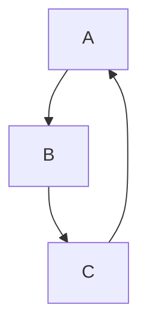

# Desarrollo-De-Interfaces

- Autor: Jorge Rivera Pozuelo
- Github: https://github.com/JorgeRiveraPozuelo
- Perfil: [@JorgeRiveraPozuelo](https://github.com/JorgeRiveraPozuelo)

---

# # Nivel 1
## Breves apuntes de Markdown
# h1
## h2
### h3
#### h4

---
# Listas

Lista desordenada se indican con giones
- Item 1
- Item 2
  - Item 2.1
  - Iteam 2.2

Lista ordenada se indica con números
1. Item 1
2. Item 2

Listas de tareas
- [X] Hacer la cama
- [x] Ducharse
- [ ] Lavarse los dientes
- [ ] Estudiar

---
## Estilos de texto
**Negrita** o __Negrita__

*Cursiva* o _Cursiva_

~Tachado~ 

---
## Formato de texto
Esto es un <sub>Subindice</sub>

Esto es un <sup>Superindice</sup>

Esto es un <ins>Subrayado</ins>

> Esto es una cita o quote

Este tipo de callouts no funcionan en GitHub, pero si en otras.
> [!info] Nota informativa
> Esto es una nota informativa

## Esto es un texto preformateado y Código fuente

```
Esto es un texto preformateado
```

Estes es el comando para inicializar un repositorio de GitHub: `git init` ¿Te ha gustado?

Y esto es un ejemplo de código de python:

```python
saludo = 'Hola Mundo!'
print( saludo )

```
## Imágenes 


---

## Menciones

@github/rube19-hub


Enlazo una nota al pie [^1]

[^nota] Esta es otra nota

|izquierda|medio|derecha|
| :--- | :---: | ---: |
| dato1 | dato2 | dato3 |
| dato4 | dato5 | dato6 |


<details>
  <summary>Este es el resumen del desplegable</summary>
  Un texto es una composición de signos codificados en un sistema de escritura que forma una unidad de sentido. También es una composición de caracteres ...
</details>



